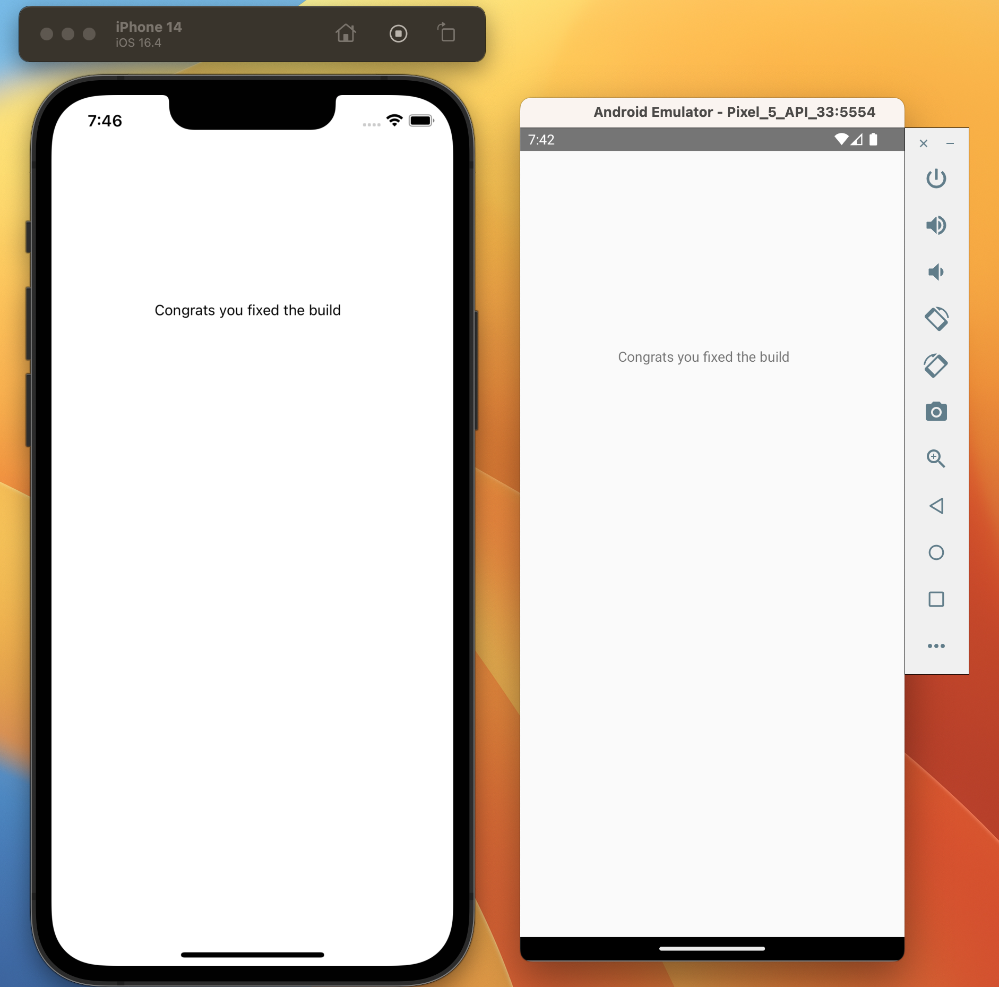

## Tonebase React Native Engineer Test

One of the main issues we encounter at tonebase with our react-native app is the frequent build errors. For this reason, it is very imperative to us that you are able to resolve build issues efficiently.

In each of these folders is a react-native template project. 

Your task is to fix the build issues or package installation issues in each. Keep in mind there are issues for both iOS and Android builds in each project.

Please download the zip of this repo and upload as a private repository on your own GitHub and add me (@pfinazzo) as a collaborator. Then open up a pull request on a separate branch that has all the fixes for each project that you were able to accomplish, so that I can look at the changes you have made and verify the results. 

Keep in mind you will need to use node version 16 for the project to compile. Your end result for each of these builds should result in your iOS and Android simulators outputting the following screens:

